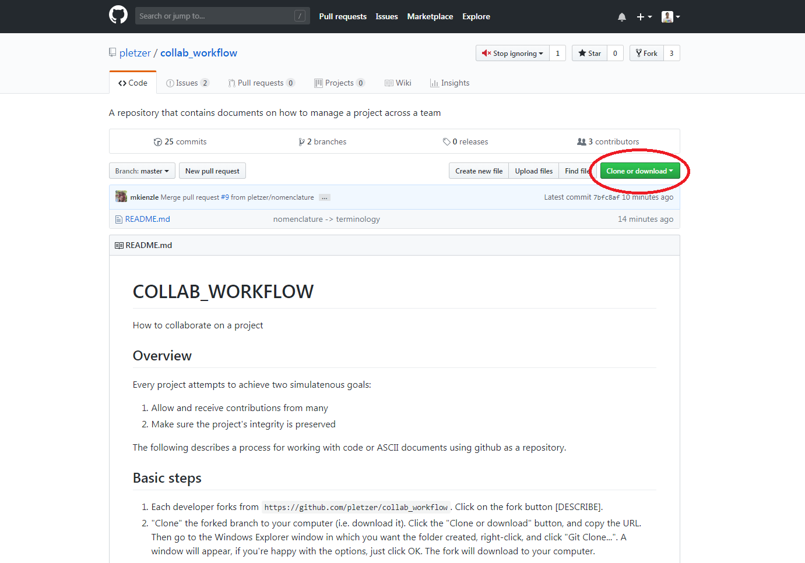

# COLLAB_WORKFLOW

How to collaborate on a project together.

## Overview

Every project attempts to achieve two simulatenous goals:

 1. Allow and receive contributions from many
 2. Make sure the project's integrity is preserved

 The following describes a process for working with code or ASCII documents using github as a repository. 

## Basic steps

 1. Each developer forks from `https://github.com/pletzer/collab_workflow`. Click on the fork button [DESCRIBE].
 
 
 2. "Clone" the forked branch to your computer (i.e. download it). Click the "Clone or download" button, and copy the URL. Then go to the Windows Explorer window in which you want the folder created, right-click, and click "Git Clone...". A window will appear, if you're happy with the options, just click OK. The fork will download to your computer.
 
 
 3. Each developer creates a branch within their own repository. A branch represents a topic (an idea, a concept, a bug fix, etc...) and should be named appropriately. In the following we call our new development branch `new_population_assessment`. The developer

    * `git checkout -b new_population_assessment` (checks out and creates the branch) [Tortoisegit](https://github.com/SamikDatta/collab_workflow/blob/tortoisegit_images/new_branch.png)
    * commits locally to their branch `git commit -a`
    * then pushes to the remote branch, `git push origin new_population_assessment`. 
 4. When the new code is ready to be merged to the master branch, the developer:
    * first merges the master branch to the current branch (to pick up any changes since the branch split from master)
      * `git merge https://github.com/pletzer/collab_workflow`
    * commits and pushes to their own remote repository
      * `git push origin new_population_assessment`
    * creates a pull-request on the web site against the `dev` branch, justifying in the text box why the change is important what has been done/achieved. The gate-keepers will assess the change to the repository. There can be back and forth discussion, all captured in the text boxes. Finally the gate-keeper agrees with the change and the `new_population_assessment` code is merged to the master branch. At that point the `new_population_assessment` branch can be deleted.

The process is shown below. Contributors fork from the "dev" branch. Each contributor creates a feature branch ("b1", "b2", "b3") which end with a pull-request. It the pull-request is accepted then the changes are incorporated into the "dev" branch. Not shown here are "dangling" branches, for which pull-requests are not made or they have not been accepted.

At specific times, when the code is judged to be stable, the `dev` branch is merged into the `master` branch.

```sequence
                              v1.0                  v1.1
master -------------------------o--------------------o---->
                                ^                    ^
                                |                    |
   dev ----.----.----o-----o--o-.-----------o--------.---->
           |    |    ^     ^  |             ^
           |    |    |     |  |             |
    b1     .---------.     |  |             |     
                |          |  |             |
    b2          .----------.  |             |
                              |             |
    b3                        .-------------.
```


## Five basic git commands

 1. `git clone <url>` makes a direct copy of repository to you local machine
 2. `git add <file>` adds a file for staging
 3. `git commit -a` commit all your changes locally (your repo copy on your machine)
 4. `git push` push your commits (changes) from your local repo to remote repo
 5. `git pull` pull updates from the remote repo to your local copy

## How to switch between different branches

Developers will typically work with different branches, e.g. `master` and `improve_logging`. First you need to fetch all the remote branches:
```
git fetch --all
```
To see all the branches type 
```
git branch
```
You can select a given branch using
```
git checkout improve_logging
```
To go back to master, just type
```
git checkout master
```

## Checking out a previous version

```
git checkout 34c8e11842
```
where the hex number can be inferred from `git status <file>` (can be abbreviated).  You can come back to the latest version by typing
```
git checkout master
```

## Terminology

 * *project repo* - the original remote repository, expected to be stable and bug free
 * *personal repo* - repo forked from the project repo
 * *master branch* - the branch that is created by default when creating the project repo or forking from the project repo
 * *feature branch* - a short lived branch that is created for the purpose of implementing a new feature
 * *local repo* - obtained when cloning a personal or project repo
 * *local changes* - changes that have not yet been committed to the local repo
 * *pushing changes* - updating the remote personal repo with the changes committed locally
 * *pulling changes* - updating the local repo with changes from the remote repo
